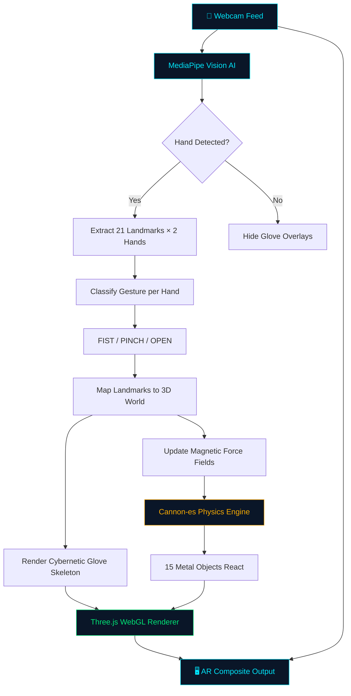
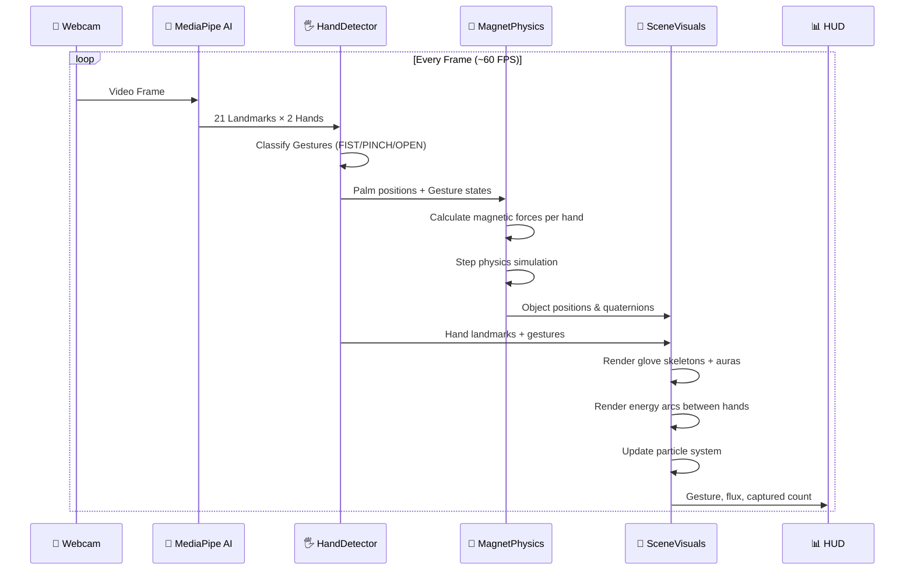
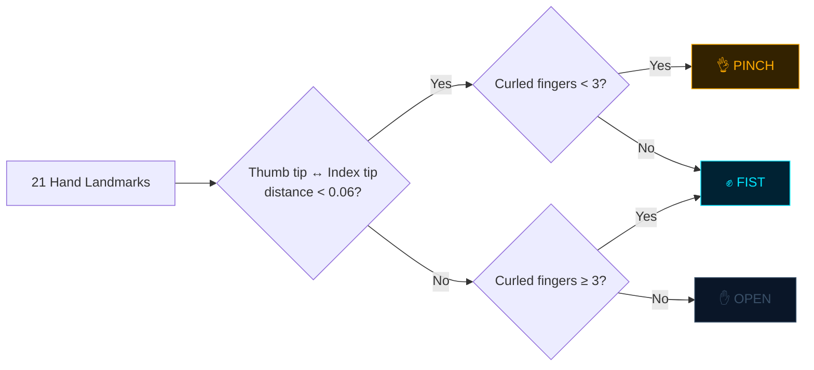
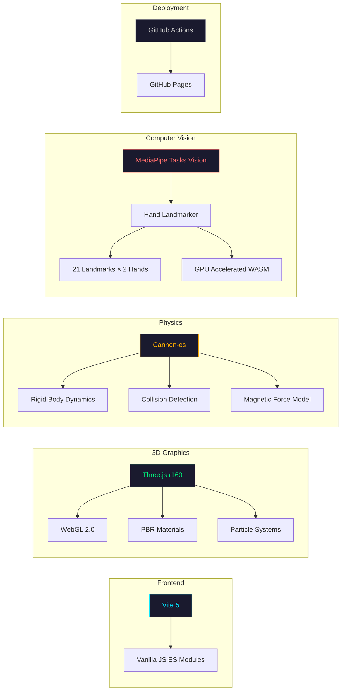

<div align="center">

# ⚡ MagnoGlove Pro

### Dual-Hand Gesture Controlled Electromagnetic AR Simulation

[](https://debddj.github.io/MagnoGlove-Demo/)
[](https://debddj.github.io/MagnoGlove-Demo/)
[](./LICENSE)

**Control virtual electromagnetic gloves with your bare hands.**
Your webcam tracks both hands in real time — make a fist to pull metallic objects,
pinch for precision mode, or open your hands to release them.

[🎮 **Try It Now**](https://debddj.github.io/MagnoGlove-Demo/) · [📖 How It Works](#-how-it-works) · [🛠 Local Setup](#-local-development)

---

</div>

## 🎯 What Is This?

MagnoGlove Pro is a **browser-based Augmented Reality** experience that turns your hands into electromagnetic gloves. Using your webcam, AI identifies your hand gestures and maps a futuristic cybernetic glove overlay onto your hands — complete with glowing energy fields, electromagnetic rings, and lightning arcs between your palms.

Metallic objects (screws, spheres, cubes, rods, and more) sit on a virtual surface. When you clench your fist or pinch your fingers, the magnetic field activates and pulls them towards your hands. Open your hands and they fall back down with realistic gravity.

### ✨ Key Features

| Feature | Description |
|---------|-------------|
| 🤲 **Dual Hand Tracking** | Both hands tracked simultaneously with independent gesture recognition |
| 🧲 **MAGNET MODE** | |
| ✊ **Fist = MAX POWER** | Strong electromagnetic pull — all objects fly toward your hands |
| 👌 **Pinch = PRECISION** | Gentle, controlled pull with amber glow and smaller field radius |
| ✋ **Open = RELEASE** | Magnetic field deactivates, objects fall with realistic gravity |
| ⚡ **Inter-Hand Arcs** | Energy lightning arcs connect both hands when magnets are active |
| 📐 **GEOMETRY MODE** | |
| 🔺 **Triangle Analysis** | Real-time Area (Heron's formula), Euclidean edge distances, and vertex angles |
| ⭕ **Circle Projection** | Single hand pinch generates a circle displaying radius, diameter, area, and circumference |
| 📈 **Predictive Math** | Calculates third-side ranges based on Triangle Inequality Theorem |
| ⚙️ **SYSTEM UTILITIES** | |
| 🔊 **Audio Tutor** | Built-in step-by-step voice synthesized narrator with on-screen subtitles |
| 📱 **Mobile Ready** | Fully responsive HUD works smoothly on phones in both Portrait and Landscape |
| 🌐 **Zero Install** | Runs entirely in the browser — just click the link and allow webcam |

---

## 🚀 Quick Start

### Option 1: Use the Live Demo (Recommended)

> **👉 [https://debddj.github.io/MagnoGlove-Demo/](https://debddj.github.io/MagnoGlove-Demo/)**

1. Click the link above
2. Wait for the AI hand-tracking model to download (~5 seconds)
3. Click **"ENGAGE AR SIMULATION"**
4. Allow webcam access when prompted
5. Show your hands to the camera and make gestures!

### Option 2: Run Locally

```bash
git clone https://github.com/Debddj/MagnoGlove-Demo.git
cd MagnoGlove-Demo
npm install
npm run dev
```

Open **http://localhost:5173** in Chrome or Edge.

---

## 🎮 Gesture Controls

```
┌─────────────────────────────────────────────────────────────────┐
│                     GESTURE CONTROL MAP                         │
├─────────────────┬───────────────┬───────────────────────────────┤
│  ✊ CLOSED FIST  │  MAGNET: ON   │  Full electromagnetic pull    │
│                 │  Color: CYAN  │  All objects fly to your hand  │
│                 │  Power: 100%  │  Strong field, large radius    │
├─────────────────┼───────────────┼───────────────────────────────┤
│  👌 PINCH       │  MAGNET: PREC │  Gentle, controlled pull       │
│                 │  Color: AMBER │  Slow approach, small radius   │
│                 │  Power: 35%   │  Precision object manipulation │
├─────────────────┼───────────────┼───────────────────────────────┤
│  ✋ OPEN HAND   │  MAGNET: OFF  │  Field deactivated             │
│                 │  Color: DIM   │  Objects fall with gravity     │
│                 │  Power: 0%    │  Natural rest state            │
└─────────────────┴───────────────┴───────────────────────────────┘
```

> **Pro Tip:** Use both hands simultaneously! Make a fist with your left hand and pinch with your right for asymmetric magnetic fields. Energy arcs will connect both hands.

---

## 📐 How It Works

### System Architecture



### Data Flow Pipeline



### Gesture Classification Logic



---

## 📏 Geometry Mode & Audio Guide

MagnoGlove Pro features a secondary application mode: **Real-Time Spatial Measurement**.

### Geometry Mode Use Cases
By toggling the **GEOMETRY** button in the HUD, the physics simulation pauses, allowing the AI to analyze spatial relationships between your fingers:
- **Two Hands (Triangle Analysis):** Using both index fingers and a thumb, the system forms a dynamic triangle in space. It actively computes Euclidean distances (in virtual `cm`), vertex angles (using vector dot products), and the total Area (using Heron's formula). It also applies the Triangle Inequality Theorem to predict valid ranges for a "missing" third side.
- **One Hand (Circles & Lengths):** Shows Euclidean link distances between all 5 fingertips. Performing a pinch generates a circumscribed circle across the pinch diameter, calculating its exact radius, circumference, and area.

### Interactive Audio Tutor
To assist users, a built-in **Voice Synthesized Narrator** (`AudioGuide.js`) was added:
- Click the speaker icon `🔊` in the top right to start the tutorial.
- The guide talks you through the controls, gestures, and geometry mode features step-by-step.
- On-screen subtitles dynamically appear at the bottom for high-noise environments and accessibility.

---

## 🏗 Project Structure

```
MagnoGlove-Demo/
├── index.html              # Entry point — video + canvas + HUD overlay
├── vite.config.js          # Vite config with GitHub Pages base path
├── package.json            # Dependencies: Three.js, Cannon-es, MediaPipe
│
├── src/
│   ├── main.js             # App orchestrator — init, animation loop, HUD
│   ├── HandDetector.js     # MediaPipe hand tracking + gesture classification
│   ├── MagnetPhysics.js    # Cannon-es physics world + magnetic force model
│   ├── SceneVisuals.js     # Three.js renderer — gloves, particles, arcs
│   └── style.css           # Dark sci-fi HUD styling
│
├── .github/
│   └── workflows/
│       └── deploy.yml      # Auto-deploy to GitHub Pages on push
│
├── .gitignore              # Excludes node_modules, dist, etc.
│
└── [Legacy Python Files]   # Original Python prototype (kept as backup)
    ├── main.py
    ├── gesture_detection.py
    ├── magnet_logic.py
    ├── simulation_3d.py
    ├── utils.py
    └── requirements.txt
```

---

## 🔧 Module Deep Dive

### `HandDetector.js` — Vision AI

| Property | Value |
|----------|-------|
| AI Model | MediaPipe HandLandmarker (float16) |
| Tracking | 2 hands simultaneously |
| Landmarks | 21 3D points per hand |
| Delegate | GPU (auto-fallback to CPU) |
| Gestures | FIST, PINCH, OPEN per hand |

**Curl Detection Algorithm:**
For each of the 4 fingers, measure the distance from fingertip to wrist. Compare against MCP knuckle-to-wrist distance. If `tip_dist < mcp_dist × 1.1`, the finger is curled. If ≥3 fingers are curled → **FIST**.

---

### `MagnetPhysics.js` — Electromagnetic Force Model

```
Force Model:
  Close range (dist < 1.2m):  F = 40 × strength × mass    (centering + damping)
  Long range  (dist > 1.2m):  F = 150 × strength × mass / (dist² × 0.3 + 0.5)

Strength Presets:
  ┌─────────────┬──────────┬───────────┬────────────┐
  │ Gesture     │ Strength │ Max Range │ Visual     │
  ├─────────────┼──────────┼───────────┼────────────┤
  │ FIST        │ 1.00     │ 12 units  │ Cyan glow  │
  │ PINCH       │ 0.35     │ 6 units   │ Amber glow │
  │ OPEN        │ 0.00     │ 0 units   │ Dim        │
  └─────────────┴──────────┴───────────┴────────────┘
```

Each hand operates its own independent magnetic field. When both hands are active, objects experience forces from both — they can be pulled between two palms, creating a dramatic tug-of-war effect.

---

### `SceneVisuals.js` — WebGL Rendering

| Component | Description |
|-----------|-------------|
| **Hand Skeleton** | 21 glowing spheres (larger at fingertips/palm) + bone connections |
| **Electromagnetic Aura** | Wireframe sphere pulsing around each palm |
| **Expanding Rings** | 3 rings per hand that expand outward during attraction |
| **Palm Glow** | Dynamic point light emanating from each palm center |
| **Energy Arcs** | Sine-wave displaced lightning between both palms |
| **Particle System** | 200 ambient particles attracted to active magnetic fields |
| **Object Glow** | Grabbed objects emit blue glow via emissive material |
| **PBR Materials** | Steel, copper, gold, iron, titanium with metalness/roughness |

---

## 🖥 System Requirements

| Component | Minimum | Recommended |
|-----------|---------|-------------|
| **Browser** | Chrome 90+ / Edge 90+ | Chrome 120+ |
| **Webcam** | Any USB or built-in | 720p+ |
| **GPU** | WebGL 2.0 support | Dedicated GPU |
| **Network** | First load: ~5 MB download | — |
| **OS** | Any (runs in browser) | — |

> **Note:** Firefox and Safari may have limited WebGL/MediaPipe performance. Chrome/Edge are recommended.

---

## 🛠 Local Development

```bash
# Clone
git clone https://github.com/Debddj/MagnoGlove-Demo.git
cd MagnoGlove-Demo

# Install
npm install

# Dev server (hot reload)
npm run dev

# Production build
npm run build

# Preview production build
npm run preview
```

---

## 🐛 Troubleshooting

| Problem | Solution |
|---------|----------|
| **Webcam not detected** | Check browser permissions. Try `chrome://settings/content/camera` |
| **"VISION AI FAILED"** | Slow network — model download timed out. Refresh and try again |
| **Objects fall through floor** | Hard refresh (`Ctrl+Shift+R`) to clear cached JS |
| **Low FPS** | Close other GPU-heavy tabs. Ensure hardware acceleration is ON in browser settings |
| **Hands not detected** | Ensure good lighting. Keep hands 30–80 cm from camera |
| **Only one hand tracked** | Move hands apart. MediaPipe needs clear separation to distinguish two hands |

---

## 📋 Technology Stack



---

## 🎬 Demo Script (For Presentations)

1. **Open** the [live demo link](https://debddj.github.io/MagnoGlove-Demo/)
2. Click **ENGAGE AR SIMULATION** → allow webcam
3. Show **both open hands** → objects sit idle on the table
4. Make **one fist** → objects fly toward that hand with cyan glow
5. Open that hand → objects drop with gravity
6. **Pinch** both hands → gentle amber pull from both sides
7. Make **both fists** → all objects rush upward, energy arcs crackle between hands
8. Open both hands → everything falls back down dramatically

---

<div align="center">

### Built with 🧲 by the AI/ML Engineering Department

**[⚡ Launch MagnoGlove Pro](https://debddj.github.io/MagnoGlove-Demo/)**

</div>
